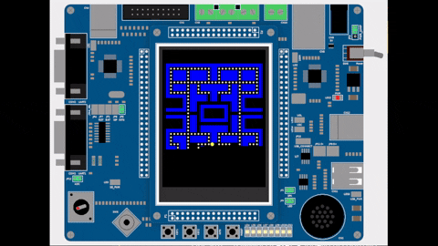
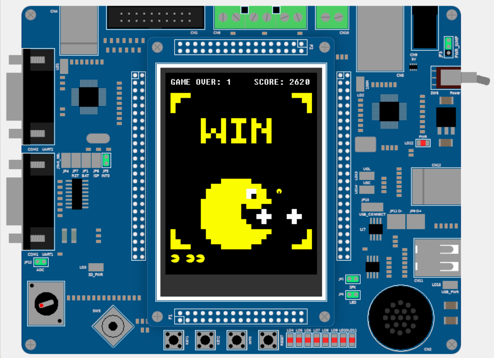
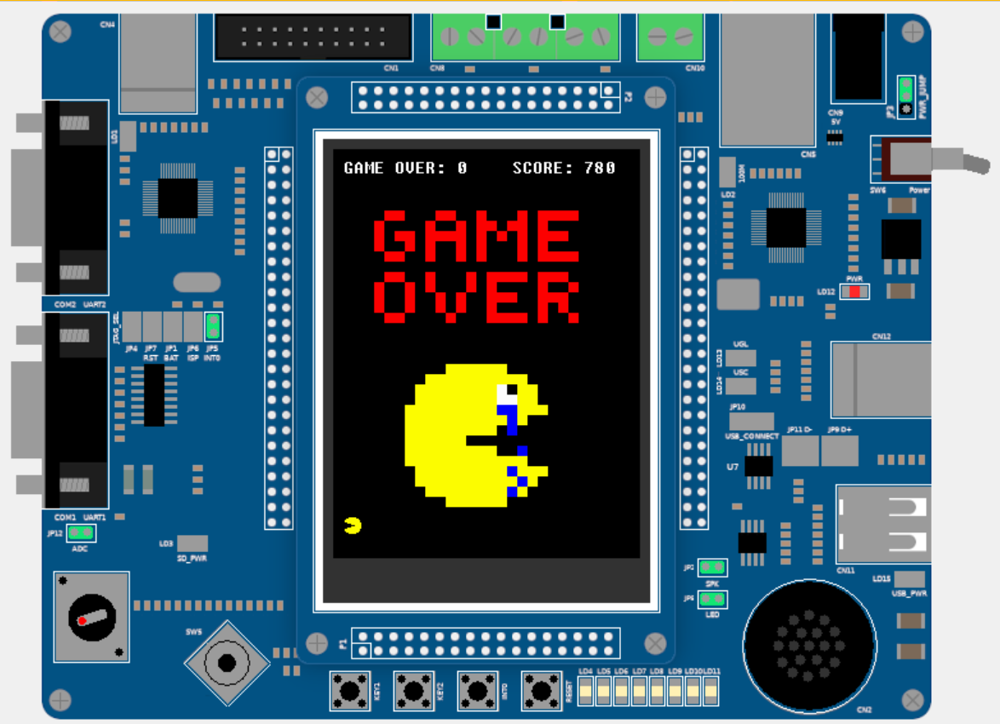

# PacMan Game for LandTiger LPC1768

A classic PacMan game implementation for the LandTiger LPC1768 microcontroller with real-time gameplay, interrupt-driven controls, and LCD graphics.

## 🎯 Features

- **Real-time gameplay** with joystick controls and 50ms game tick
- **LCD graphics** with custom rendering system
- **Interrupt-driven architecture** for responsive controls
- **Game mechanics**: scoring, lives, power pills, pause/resume
- **Embedded optimization** for ARM Cortex-M3 constraints

## 🔧 Hardware

- **LandTiger LPC1768** development board
- **LCD Display** (240x320 pixels)
- **Joystick** for movement controls
- **Push buttons** for game control

## 🚀 Quick Start

1. Open `sample.uvprojx` in **Keil μVision**
2. Build project (`F7`) 
3. Flash to LPC1768 board
4. Use **joystick** to move, **buttons** to pause/resume

## 🏗️ Architecture

```
Source/
├── sample.c              # Main application
├── game_logic/           # Game state and mechanics
├── draw_img/             # Graphics rendering
├── joystick/             # Input handling
├── GLCD/                 # LCD drivers
├── timer/ & RIT/         # Timing systems
└── button_EXINT/         # Interrupt handling
```

## ⚙️ Technical Details

- **MCU**: LPC1768 (ARM Cortex-M3, 100MHz)
- **Memory**: 64KB SRAM, 512KB Flash
- **Real-time**: 50ms RIT for smooth gameplay
- **Interrupts**: External (buttons) + Timer (game logic)
- **Power**: Sleep modes when idle

## 🎮 Gameplay Overview

### Game Demo (emulated)
<div align="center">
  
</div>

### Some game screens
<div align="center">
  
  
</div>

*Win screen (left) and Game Over screen (right)*